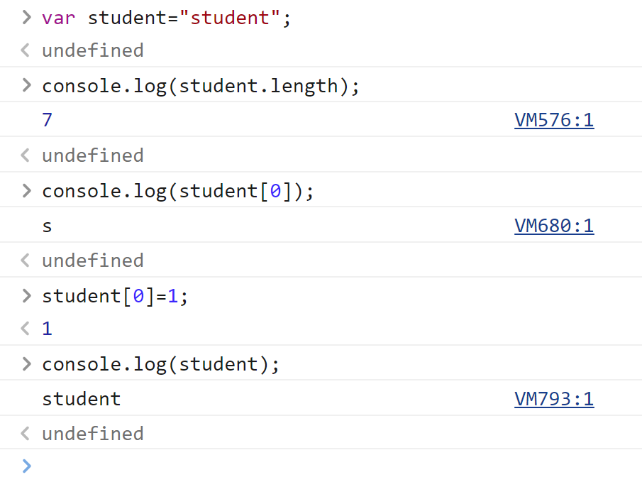

# JavaSciprt

## 1.引入JavaSciprt

### 1.内部标签

```javascript
<script>
    //......
</script>
```

### 2.外部引入

在h5文件的<head>标签内

```
<script src="abc.js"><script>
```

## 2.基本语法

1.申明变量

```
var 变量名=xxx
```

2.条件语句

```
if（条件）{

}if else（条件）{

}else（条件）{

}
```

3.程序员调试用，显示在控制台

```
consloe.log(xxx)
```

4.打印

```
document.write("xxx");
```

5.弹框弹出信息

```
alert("xxx")；
```

## 3.数据类型简介

#### 变量：

var

```
var a = 1；
```

#### number：

js不区分小数和整数

```js
123 //整数123
123.1 //浮点数123.1
1.123e3 //科学计数法
-99 //复数
NaN //not a number
Infinity //无限大
```

浮点数问题，尽量避免使用浮点数进行运算，因为存在精度损失问题。

#### 字符串''、"":

'abc'、"abc"

#### 布尔值：

true、flase

#### 逻辑运算：

```
&& 与

|| 或

！ 非
```

#### 比较运算符：

```
=
== 等于（类型不一样，值也一样，也会判定为true）
===  绝对等于（当且仅当类型一样，值一样，结果为ture）
```

所以最好用===来比较，而不用==

- 须知：NaN！=NaN，这个与所有的数值都不相等，包括自己
- 只能用isNaN(NaN)来判断这个数是否是NaN

#### null和undefined

- null 空
- undefined 未定义

#### 数组

C、Java数组里元素必须是相同类型的对象，JS不需要这样，这是它的不严谨性

取数组下标，如果越界了，就会报错undefined

#### 对象

对象是大括号，数组是中括号

每个属性之间使用逗号隔开，最后一个不需要添加

```
//Person person = new Person（1，2，3,4,5）；
var person={
    name：“qinjiang”，
    age：3，
    tags：['js','java','web','...']
}
```

## 4.严格审查模式

在第一行（如果是html就是在script标签内第一行写'use strict'）;严格审查模式，预防JavaScript的随意性导致产生的一些问题（需要IDEA设置支持ES6语法

ES6中 用let定义变量，局部变量都建议用let定义

## 5.字符串

1.正常的字符串我们使用 单引号，或者双引号包裹

2.注意转义字符\

```
\'
\n
\t
\u4e2d \u#### Unicode字符

```

3.多行字符串编写

```
//tab键上面 esc键下面 使用``括起来
var msg =
     `hello
world
你好ya
你好`
```

4.模板字符串

```
let name="qinjiang";
let age=3;
let msg=`你好呀，${name}`;  //不用像java一样用+拼接
console.log(msg);
```

5.字符串长度

```
str.length
```

6.字符串具有不可变性




这里试图用student[0]=1改变student字符串，且赋值成功，但再次打印student字符串时仍显示保持不变

7.大小写转换

```javascript
//注意，这里是方法，不是属性了
student.toUpperCase()
student.toLowerCase()
```

8.获取指定下标

```
xxx.indexOf('获取内容')；
```

9.substring

```
student.substring(1) //从第一个字符串截取到最后一个字符串
student.substring(1,3)//从第一个字符串截取到第三个字符串
```

## 6.数组

Array可以包含任意的数据类型

```
var arr=[1,2,3,4,5,6];//通过下标取值和赋值
arr[0];
arr[0]=1;
```

1、长度

```javascript
arr.length
```

注意：加入给arr.length赋值，数组大小就会发生变化~，如果赋值过小，元素就会丢失

2、indexOf

通过元素获得下标索引，用法同字符串

注：字符串"1"和数字1不同

3.slice() 

截取Array的一部分，返回一个新的数组

```
arr=[1,2,3,4,5,6,"1","2"];
arr.slice(3);  //输出[4,5,6,"1","2"]
arr.slice(1,5); //输出[2,3,4,5]
```

4.push,pop

类似栈的操作,操作于数组的尾部

```
push:压入到尾部
pop:弹出尾部的一个元素
```

5.unshift(),shift()

类似栈的操作，操作与数组的头部

```
unshift:压入到头部
shift:弹出头部的一个元素
```

6.排序 sort()

```
(3)["B","C","A"];
arr.sort();
//输出(3)["A","B","C"];
```

相反的，使用元素反转指令xxx.reverse()可以输出得到["C","B","A"]的结果

7.拼接 concat()

```js
（3）["C","B","A"];
arr.concat([1,2,3])
(6)["C","B","A",1,2,3]
arr
(3)["C","B","A"]
```

注意：concat()并没有修改数组，只是会返回一个新的数组

8.连接符join

打印拼接数组，使用特定的字符串连接

```js
（3）["C","B","A"]
arr.join('-')
"C-B-A"
```

9.多维数组

```
arr=[[1,2],[3,4],["5","6"]];
arr[1][1]
4
```

