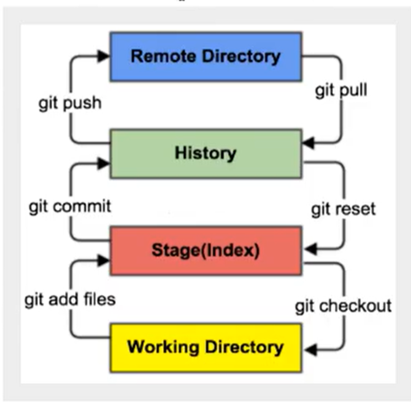

## Git笔记

### 一.安装

Git Bash：Unix与Linux风格的命令行，使用最多，推荐最多

Git CMD：Windows风格的命令行

Git GUI：图形界面的Git，不建议初学者使用，尽量先熟悉常用命令

### 二.常用Linux命令

1）cd:   改变目录

2）cd..  回退到上一个目录，直接cd进入默认目录

3）pwd  显示当前所在的目录路径

4）Is(II)  都是列出当前目录中的所有文件，只不过II(两个I)列出的内容更详细

5）touch  新建一个文件 如touch index.js 就会在当前目录下新建一个index.js文件

6）rm  删除一个文件，rm index.js就会把index.js文件删除

7）mkdir  新建一个目录，就是新建一个文件夹

8）rm -r  删除一个文件夹，rm -r src 删除src目录

9）mv移动文件，格式：mv index.html src 

index.html 是我们要移动的文件，src是目标文件夹 当然这样写，必须保证文件和目标文件夹在同一目录下。

10）reset  重新初始化终端/清屏

11）clear  清屏

12）history  查看命令历史

13）help  帮助

14）exit  退出

15）# 表示注释

### 三.Git 相关的配置文件

本机git安装目录：C:\Program Files\Git 

1）System 系统级，全局配置 C:\Program Files\Git\etc 里的gitconfig文件

2）用户配置 global全局 C:\Users\86158 里的.gitconfig文件

### 四.完善本机信息

git config --global user.name "###" (##为自己设置的名字）

git config --global user.email "###"   (###为邮箱号)

### 五.Git基本理论（核心）

#### 工作区域

Git本地有三个工作区域：工作目录（Working Directory）、暂存区（Stage/Index）、资源库（Repository或Git Directory）。如果在加上远程的git仓库（Remote Directory）就可以分为四个工作区域。文件在这四个区域之间的转换关系如下：

Workspace：工作区，就是你平时存放项目代码的地方

Index/Stage：暂存区，用于临时存放你的改动，事实上它只是一个文件，保存即将提交到文件列表信息

Repository：仓库区（或本地仓库），就是安全存放数据的位置，这里面有你提交到所有版本的数据。其中HEAD指向最新放入仓库的版本

Remote：远程仓库，托管代码的服务器，可以简单的认为是你项目组中的一台电脑用于远程数据交换

#### 工作流程

git的工作流程一般是;

1.在工作目录中添加修改文件;

2.将需要进行版本管理的文件放入暂存区域；

3.将暂存区域的文件提交到git仓库。

因此，git管理的文件有三种状态：已修改（modified），已暂存（staged），已提交（committed）

### Git项目搭建

#### 创建工作目录与常用指令

##### 创建本地仓库

git init 初始化本地项目

###### 克隆远程仓库

将远程服务器上的仓库完全镜像一份至本地

#克隆一个项目和它的整个代码历史（版本信息）

$ git clone [url]

url可以从GitHub或者Gitee上面的远端仓库找到

### Git文件操作

##### 文件的四种状态

Untracked：未跟踪，此文件在文件夹中，但并没有加入git库，不参与版本控制.通过git add 状态变成Staged

Unmodify：文件已经入库，未修改，即版本库中的文件快照内容与文件夹中完全一致。这种类型的文件有两种去处，如果它被修改，而变为Modified.如果使用git rm移除版本库，则成为Untracked文件

Modified：文件已修改，仅仅是修改，并没有进行其他的操作。这个文件也有两个去处，通过git add可进入暂存staged状态，使用git checkout 则丢弃修改过，返回到unmodify状态，这个git checkout则从库中取出文件，覆盖当前修改!

Staged：暂存状态，执行git commit 则将修改同步到库中，这时库中的文件和本地文件又变为一致，文件为Unmodify状态。执行git reset HEAD filename 取消暂存，文件状态为Modified

##### 查看文件状态

#查看指定文件状态

git status [filename]

#查看所有文件状态

git status

#git add .  添加所有文件到暂存区

#git commit -m"消息内容"  提交暂存区中的内容到本地仓库 -m 提交信息

##### 忽略文件

有在目录下建议".gitignore"文件，此文件有如下规则:

1.忽略文件中的空行或以井号（#）开始的行将会被忽略。

2.可以使用Linux通配符。例如：星号（*）代表任意多个字符，问号（  ？）代表一个字符，方括号（[abc]）代表可选字符范围，大括号（{sting1，string2，......}）代表可选的字符串等。

3.如果名称的最前面有一个感叹号（  ！），表示例外规则，将不被忽略。

4.如果名称的最前面是一个路径分隔符（/），表示要忽略的文件在此目录下，而子目录中的文件不忽略。

5.如果名称的最后面是一个路径分隔符（/），表示要忽略的是此目录下该名称的子目录，而非文件（默认文件或目录都忽略）

### IDEA中集成Git

1.新建项目，绑定git

- 将远程的git文件目录拷贝到项目中即可！
- 注意观察idea中的文件变化

2.完成项目后，点击右上角提交，并且需要输入提交信息。

3.在下方终端输入git add .

4.在下方终端输入git push 进行上传到远端
