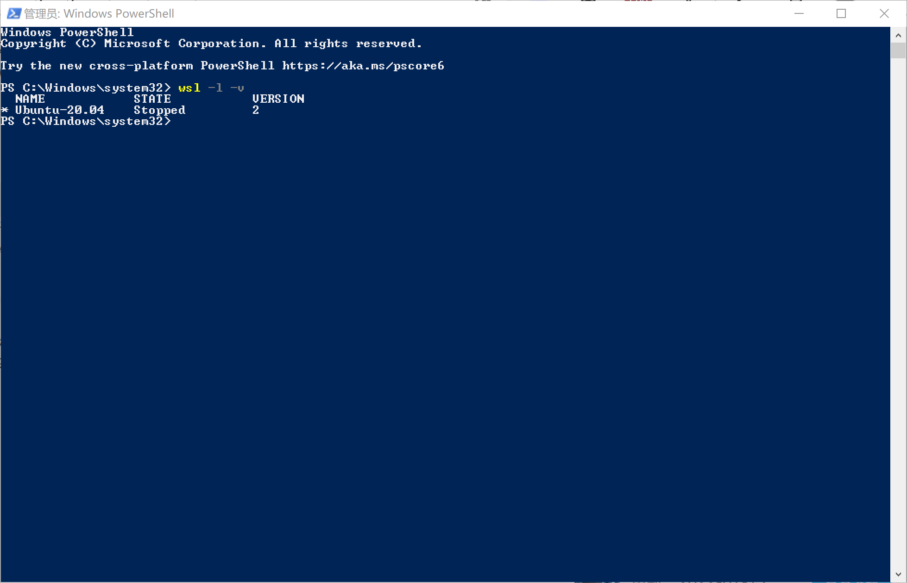
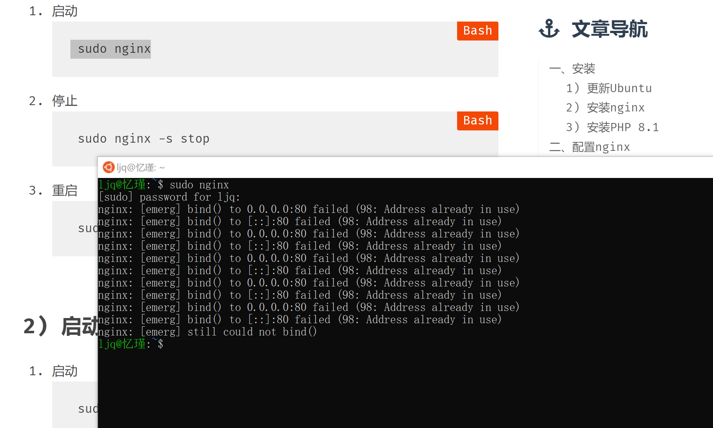
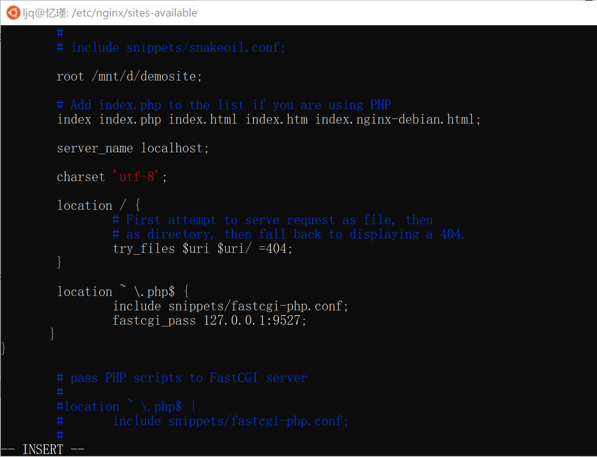
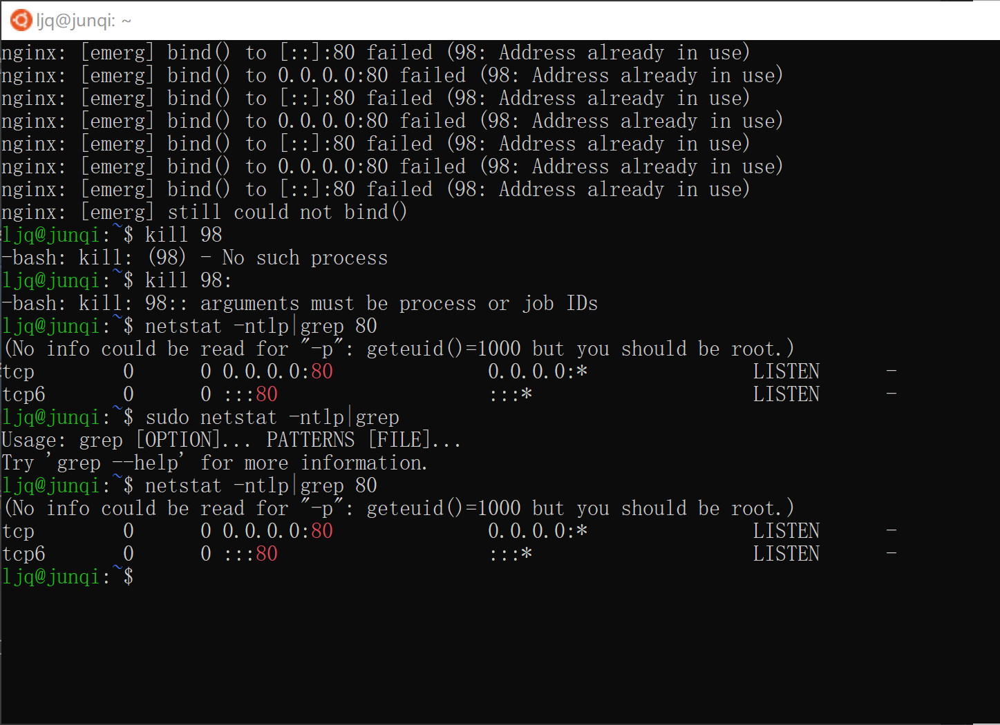

### WSL2安装

由于我在上个寒假因为完成新生项目的缘故，在导师的带领下已经完成了wsl2的环境配置和安装

所以没有保存每一步的过程截图 仅有的是我现在翻群聊记录当时我在安装过程提问的图片

#### 目前查询的版本信息:

#### 一些远古安装过程截图:

#### 一些残留的深刻记忆（教训）：

1.电脑用户名一定要用英文，不然会报一堆错误

2.一定要安装老师写的安装步骤一步步走

3.学好Linux基本操作指令