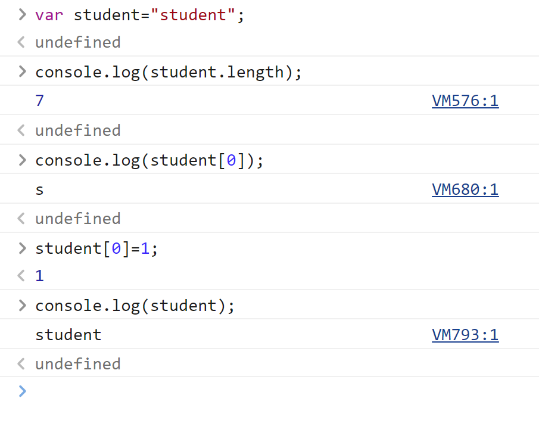

# JavaSciprt

## 1.引入JavaSciprt

### 1.内部标签

```javascript
<script>
    //......
</script>
```

### 2.外部引入

在h5文件的<head>标签内

```
<script src="abc.js"><script>
```

## 2.基本语法

1.申明变量

```
var 变量名=xxx
```

2.条件语句

```
if（条件）{

}if else（条件）{

}else（条件）{

}
```

3.程序员调试用，显示在控制台

```
consloe.log(xxx)
```

4.打印

```
document.write("xxx");
```

5.弹框弹出信息

```
alert("xxx")；
```

## 3.数据类型简介

#### 变量：

var

```
var a = 1；
```

#### number：

js不区分小数和整数

```js
123 //整数123
123.1 //浮点数123.1
1.123e3 //科学计数法
-99 //复数
NaN //not a number
Infinity //无限大
```

浮点数问题，尽量避免使用浮点数进行运算，因为存在精度损失问题。

#### 字符串''、"":

'abc'、"abc"

#### 布尔值：

true、flase

#### 逻辑运算：

```
&& 与

|| 或

！ 非
```

#### 比较运算符：

```
=
== 等于（类型不一样，值也一样，也会判定为true）
===  绝对等于（当且仅当类型一样，值一样，结果为ture）
```

所以最好用===来比较，而不用==

- 须知：NaN！=NaN，这个与所有的数值都不相等，包括自己
- 只能用isNaN(NaN)来判断这个数是否是NaN

#### null和undefined

- null 空
- undefined 未定义

#### 数组

C、Java数组里元素必须是相同类型的对象，JS不需要这样，这是它的不严谨性

取数组下标，如果越界了，就会报错undefined

#### 对象

对象是大括号，数组是中括号

每个属性之间使用逗号隔开，最后一个不需要添加

```
//Person person = new Person（1，2，3,4,5）；
var person={
    name：“qinjiang”，
    age：3，
    tags：['js','java','web','...']
}
```

## 4.严格审查模式

在第一行（如果是html就是在script标签内第一行写'use strict'）;严格审查模式，预防JavaScript的随意性导致产生的一些问题（需要IDEA设置支持ES6语法

ES6中 用let定义变量，局部变量都建议用let定义

## 5.字符串

1.正常的字符串我们使用 单引号，或者双引号包裹

2.注意转义字符\

```
\'
\n
\t
\u4e2d \u#### Unicode字符

```

3.多行字符串编写

```
//tab键上面 esc键下面 使用``括起来
var msg =
     `hello
world
你好ya
你好`
```

4.模板字符串

```
let name="qinjiang";
let age=3;
let msg=`你好呀，${name}`;  //不用像java一样用+拼接
console.log(msg);
```

5.字符串长度

```
str.length
```

6.字符串具有不可变性




这里试图用student[0]=1改变student字符串，且赋值成功，但再次打印student字符串时仍显示保持不变

7.大小写转换

```javascript
//注意，这里是方法，不是属性了
student.toUpperCase()
student.toLowerCase()
```

8.获取指定下标

```
xxx.indexOf('获取内容')；
```

9.substring

```
student.substring(1) //从第一个字符串截取到最后一个字符串
student.substring(1,3)//从第一个字符串截取到第三个字符串
```

## 6.数组

Array可以包含任意的数据类型

```
var arr=[1,2,3,4,5,6];//通过下标取值和赋值
arr[0];
arr[0]=1;
```

1、长度

```javascript
arr.length
```

注意：加入给arr.length赋值，数组大小就会发生变化~，如果赋值过小，元素就会丢失

2、indexOf

通过元素获得下标索引，用法同字符串

注：字符串"1"和数字1不同

3.slice() 

截取Array的一部分，返回一个新的数组

```
arr=[1,2,3,4,5,6,"1","2"];
arr.slice(3);  //输出[4,5,6,"1","2"]
arr.slice(1,5); //输出[2,3,4,5]
```

4.push,pop

类似栈的操作,操作于数组的尾部

```
push:压入到尾部
pop:弹出尾部的一个元素
```

5.unshift(),shift()

类似栈的操作，操作与数组的头部

```
unshift:压入到头部
shift:弹出头部的一个元素
```

6.排序 sort()

```js
(3)["B","C","A"];
arr.sort();
//输出(3)["A","B","C"];
```

相反的，使用元素反转指令xxx.reverse()可以输出得到["C","B","A"]的结果

7.拼接 concat()

```js
(3)["C","B","A"];
arr.concat([1,2,3])
(6)["C","B","A",1,2,3]
arr
(3)["C","B","A"]
```

注意：concat()并没有修改数组，只是会返回一个新的数组

8.连接符join

打印拼接数组，使用特定的字符串连接

```js
(3)["C","B","A"]
arr.join('-')
"C-B-A"
```

9.多维数组

```
arr=[[1,2],[3,4],["5","6"]];
arr[1][1]
4
```

## 7.对象

```javascript
var 对象名 ={
    属性名：属性值,
    属性名：属性值,
    属性名：属性值
}
//eg.
var person ={
    name:"xioaming",
    age:3,
    email:"xxx@qq.com",
    score:0,
}
```

Js中对象，{......}表示一个对象，键值对描述属性xxxx:xxxx，多个属性之间用逗号隔开，最后一个属性不加逗号！

JavaScript中的所有的键都是字符串，值是任意对象！	

1.对象赋值

```javascript
person.name = "xiaoming"
"xiaoming"
person.name
"xiaoming"
```

2.使用一个不存在的对象属性，不会报错！undefined

```javascript
person.haha
undefined
```

3.动态的删减属性，通过delete删除对象的属性

```javascript
delete person.name
true
person
```

4.动态的添加，直接给新的属性添加值即可

```javascript
person.haha="haha"
"haha"
person
```

5.判断属性值是否在这个对象中！xxx in xxx

```javascript
'age' in person
true
//继承
'toString' in person
true
```

6.判断一个属性是否是这个对象自身拥有的hasOwnProperty()

```javascript
person.hasOwnProperty('toString')
false
person.hasOwnProperty('age')
true
```

## 8.流程控制

if 判断

```javascript
var age = 3;
if (age>3){
    alert("haha");
}else if(age=3){
    alert("ku~")
}
else{
    alert("kuwa~");
}
```

while循环，避免程序死循环

```javascript
while(age<100){
    age=age+1;
    console.log(age)
}
do{
    age=age+1;
    consloe.log(age)
}while(age<100)
```

for循环

```javascript
for(let i =0;i<100;i++){
    consloe.log(i)
}
```

forEach循环

```javascript
var age =[12,3,12,3,12,31,23,123];
//函数
age.forEach(function(value){
    consloe.log(value)
    //逐个遍历age里面的元素
})
```

for...in

```javascript
//for(var index in object){}
for(var num in age){
    if(age.hasOwnProperty(num)){
        consloe.log("存在")
        consloe.log(age[num])
    }
}

```

## 9.Map和Set

Map:

```javascript
//ES6 Map
//学生的成绩，学生的名字
//var names=["tom","jack","haha"];
//var scores=[100,90,80];

var map = new Map([['tom',100],['jack',90],['haha',90]]);
var name = map.get('tom');//通过key获得value
map.set('admin',123456); //新增或修改
map.delete("tom");//删除

```

Set:无序不重复的集合

```javascript
set.add(2);//添加
set.delete(1); //删除
consloe.log(set.has(3));//是否包含某个元素！
```

## 10.iterator

遍历数组

```javascript
//通过for of/ for in 下标
var arr=[3,4,5]
for(var x of arr){
    consloe.log(x)
}
```

遍历map

```javascript
var map = new Map([["tom",100],["jack",90],["haha",80]]);
for(let x of map){
    consloe,log(x)
}
```

遍历set

```javascript
var set =new Set([5,6,7]);
for(let x of set){
    consloe.log(x)
}
```

## 11.函数

### 1.定义函数


> 定义方式一

​		绝对值函数

```javascript
function abs(x){
    if(x>=0){
        retrun x;
    }else{
        return -x;
    }
}
```

一旦执行到return代表函数结束，返回结果！

如果没有执行return,函数执行完也会返回结果，结果就是undefined

> 定义方式二

```javascript
var abs =function(x){
    if(x>=0){
        retrun x;
    }else{
        return -x;
    }
}
```

function(x){....}这是一个匿名函数。但是可以把结果赋值给abs,通过abs就可以调用函数！	

> 调用函数

```javascript
abs(10) //10
abs(-10) //10
```

参数问题：javaScript可以传任意个参数，也可以不传递参数

```javascript
var abs =function(X){
    //手动抛出异常来判断
    if(typeof x!=='number'){
        throw 'Not a Number';
    }
    if(x>=0){
        return x;
    }else{
        return -x;
    }
}
```

> arguments

`agruments`是一个JS的关键字

代表传递进来的所有的参数，是一个数组。

```javascript
var abs =function(X){
    consloe.log("x=>"+x);
    for(var i =0;i<arguments.length;i++){
        consloe.log(arguments[i]);
    }
    if(arguments.length==2){
        else if(arguments.length==3){
            
        }
    }
    if(x>=0){
        return x;
    }else{
        return -x;
    }
}
```

问题：arguments包含所有的参数，但我们有些时候想用多余的参数进行附加操作。需要排除已有参数。

> rest

以前：

```javascript
if (arguments.length>2){
    for(var i=2,i<arguments.length;i++){
        //......
    }
}
```


ES6引入的新特性，获取除了已经定义的参数外的所有参数

```javascript
function aaa(a,b,...reset){
    console.log("a=>"+a);
    console.log("b=>"+b);
    console.log(rest);
}
```

rest参数只能写在最后面，必须用...标识

### 2.变量的作用域

在JavaScript中，var定义的实际是有作用域的。

假设在函数体中申明，则在函数体外不可以使用~（可以用闭包实现）

```javascript
function qj(){
    var x = 1;
    x = x + 1;
}

x=x+2;//Uncaught ReferenceError:x is not defined
```

如果两个函数使用了相同的变量名，只要在函数内部，就不冲突

```javascript
function qj(){
    var x = 1;
    x = x + 1;
}
function qj2(){
    var x = 1;
    x = x + 1;
}
//是不冲突的
```

内部的函数可以访问外部函数的成员，反之则不行

```javascript
function qj{
    var x = 1;
    function qj2{
        var y = x + 1;
    }
    var z=y+1;//Uncaught ReferenceError:y is not defined
}
```

> 提升变量的作用域

```javascript
function qj2(){
    //var x,y,z......
    var x="x"+y;
    consloe.log(x);
    var y ='y';
}    
```

这个是在JavaScript建立之初就存在的特性。

所有的变量定义都放在函数的头部，便于代码维护。	

默认所有的全局变量，都会自动绑定在windows对象目录下

全局变量window

```javascript
var x ='xxx';
alter(x);
alter(window.x);//默认
```

JavaScript实际上只有一个全局作用域，任何变量（函数也可以视作变量），假设没有在函数作用范围内找到,就会向外查找，如果是在全局作用域都没有找到，报错RefrenceError

> 规范

由于我们所有的全局变量都会绑定到我们的window上。如果不同的js文件，使用了相同的全局变量，冲突~>如何减少冲突？

```javascript
//唯一全局变量
var App = {};

//定义全局变量
App.name = "apple";
App.add = function(a,b){
    return a + b;
}
```

把自己的代码全部放入自己定义的唯一空间名字中，降低全局命名冲突的问题~

> 局部作用域let

ES6 let 关键字，解决局部作用域冲突问题！

eg.

```javascript
function aaa(){
    for(var i = 0;i<100；i++){
        console.log(i)
    }
    console.log(i+1);//问题？i出了这个作用域还可以使用
}
```

```javascript
function aaa(){
    for(let i = 0;i<100；i++){
        console.log(i)
    }
    console.log(i+1);//报错：Uncaught ReferenceError:i is not defined
}
```

> 常量const

在ES6引入了常量关键字const

```javascript
const PI = '3.14' //只读变量
consloe.log(PI);
PI = '123';//TypeError:Assignment to constant variable.
consloe.log(PI);
```

## 12.方式

> 定义方法

方法就是把函数放在对象的里面，对象只有两个东西：属性和方法

```javascript
var jimmy ={
    name:'阿瑾',
    birth:2000,
    //方法
    age:function(){
        //今年- 出生的年
        var now = new Date().getFullYear();
        return now-this.birth;
    }
}
//属性
jimmy.name
//方法，一定要带 ()
jimmy.age()
```

  this.代表什么？拆开上面的代码看看~

```javascript
function getAge(){
    //今年 - 出生的年
    var now = new Date().getFullYear();
    return now-this.birth;
}
var jimmy ={
    name:'阿瑾',
    birth:2000,
    age:getAge
}
//kuangshen.age() ok
//getAge() NaN window
```

this是无法指向的，是默认指向调用它的那个对象；

> apply

在js中可以控制this的指向！

```javascript
function getAge(){
    //今年 - 出生的年
    var now = new Date().getFullYear();
    return now-this.birth;
}

var jimmy = {
    name:'阿瑾'，
    birth：2000，
    age：getAge
};

//kuangshen.age()ok
getAge.apply(jimmy,[]);//this,指向了 jimmy,参数为空
```

## 13.

1.

2.


